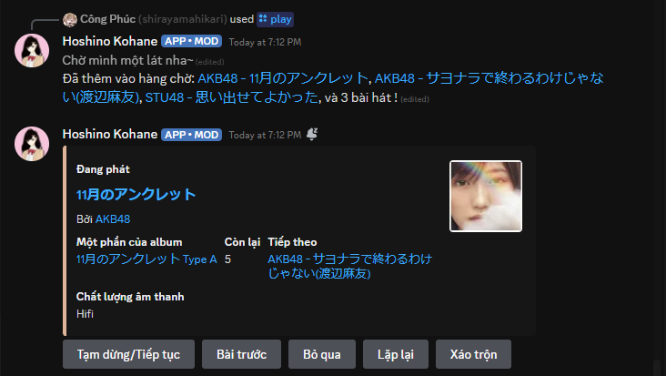

<div align="center">
  <a href="https://twitter.com/AkaguroKana">
      
  </a>
  <p>Minh họa bởi 赤黒佳奈 | Akaguro Kana</p>
  <h1>FIA Discord Music Bot - Codename: 星野小羽 | Hoshino Kohane</h1>
  <h3> Dựa trên nguyên tác <a href="https://github.com/Shewiiii/Ugoku-v2">Ugoku-v2</a> của <a href="https://twitter.com/Shewiiiiiii">Shewi</a>, Việt hóa, sửa đổi và thêm tính năng bới Công Phúc </h3>
</div>

<h2> Tính năng </h2>

- Tài nguyên yêu cầu thấp, có thể sử dụng trên các máy chủ tài nguyên thấp như laptop cũ
- Ping
- Echo (làm cho bot lặp lại bất kỳ tin nhắn nào của mình)
- Gửi Record training tự động, đồng thời gửi thông báo về quản trị viên / máy chủ quản trị khi có người dùng xin record, xóa tin nhắn để tránh loãng kênh chat, và gửi lỗi khi người dùng xin sai Record hoặc Record không tồn tại
- Tải bộ stickers từ Line (giúp đa dạng hóa số emoji / stickers trên Discord :) )
- Tải nhạc từ Spotify
- Tải nhạc chất lượng rất cao từ Deezer
  - Hỗ trợ tải tệp bài hát lên xô S3 nếu tệp bài hát nặng hơn giới hạn tải tệp của máy chủ.
- Phát nhạc trong kênh thoại:
  - Bỏ qua, Hiển thị hàng chờ, Tự động nhận diện và thêm bài hát/album/danh sách phát.
  - Lặp lại bài hát/hàng chờ, Tạm dừng, Tiếp tục...
  - Chất lượng âm thanh cao, không bị giới hạn (hơn hẳn Jockie Music)
  - Phát nhạc từ Spotify
  - Phát nhạc chất lượng cao (nếu bài hát đó có trên Deezer)
  - Phát các tác phẩm âm thanh (音声作品) trên kênh thoại (tại sao không chứ)
  - Phát video từ YouTube
  - Phát nhạc từ một URL (nguồn tùy chỉnh)
  - Lưu lại bài hát đã phát (nguồn tùy chỉnh)
  - Thêm các metatdata của bài hát
  - Hiển thị lời bài hát đang phát hoặc bài hát bất kỳ (Sử dụng API Musixmatch)
- Trò chuyện với Gemini 2.0 Flash (đang phát triển)
  - Làm cho các tin nhắn giống con người hơn
  - Có "ký ức vính viễn" (sử dụng Pinecone)
- Hiển thị một ảnh bất kỳ từ Danbooru (wibu for the win ^^ ) (ảnh phù hợp với gia đình)
> [!NOTE]
> Một số tính năng của bot có thể hoạt động trong máy chủ có bot đang hoạt động, hoặc bằng cách nhắn tin trực tiếp với bot. Chi tiết thêm, cùng với các lệnh hiện có, cấu trúc và ví dụ, vui lòng truy cập: <a href="https://docs.google.com/spreadsheets/d/1nqn9kcO2LbQ6BacGJDaFbIAkA6jvT0HV3kM7ZRiqoow"> Google Sheet chính thức </a> hoặc dùng lênh `/help`

<h2> Yêu cầu </h2>

- Python >= 3.10.x, <= 3.12.x (Chưa được thử nghiệm với Python 3.9, nhưng nó có khả năng dùng được)
- Token bot trên Discord (lấy tại [đây](https://discord.com/developers/applications))

Bot phát nhạc (Tùy chọn nhưng khuyên dùng):
- Một ứng dụng trên Spotify (lấy tại [đây](https://developer.spotify.com/))
- Một tài khoản Spotify Premium hoặc Deezer Premium (YouTube vẫn hoạt động bình thường)
- (Tùy chọn) Một khóa API của Imgur (lấy tại [đây](https://imgur.com/account/settings/apps)), để hiển thị ảnh bìa bài hát từ một nguồn khác.

Chatbot:
- Khóa API của Gemini (lấy tại [đây](https://aistudio.google.com/app/apikey))
- (Tùy chọn) Khóa API của Pinecone nếu muốn có ký ức vĩnh viễn

<h2>Hướng dẫn sử dụng nhanh</h2>

>[!NOTE]
> Hướng dẫn thiết lập chi tiết có thể xem tại [đây](https://github.com/TimTCG/Ugoku-v2)

- Clone repo hiện tại.
- Tạo môi trường ảo.
```bash
python -m venv venv
```
HOẶC
```bash
python3 -m venv venv
```
- Bật môi trường ảo

Windows:
```bash
./venv/Scripts/activate.bat
```
Linux:
```bash
source venv/bin/activate
```
- Cài đặt các phần mềm cần thiết
```bash
python -m pip install -r requirements.txt
```
HOẶC
```bash
python3 -m pip install -r requirements.txt
```
- [Tạo một bot trên Discord](https://guide.pycord.dev/getting-started/creating-your-first-bot), hoặc thêm nó vào ứng dụng của mình. Bạn có thể theo dõi 3 phần đầu của hướng dẫn.
- Tạo một file `.env` ở thư mục chứa bot.
- Thiết lập các giá trị môi trường theo tính năng cấn thiết, dựa vào tệp mẫu `.env.template`.
- Khởi động lại IDE (để cập nhất biến giá trị môi trường).
- Thiết lập và bật các tính năng cần thiết trong tệp `config.py`.
- Chạy `main.py`.
- Nếu tính năng Spotify được bật, hãy đăng nhập vào Librespot bằng cách vào Spotify và chọn thiết bị của bot.
> [!TIP]
> Hành động này sẽ tạo ra một tệp `credentials.json` trong thư mục chứa bot. Nếu gặp vấn đề trong lúc đăng nhập, hãy thử tạo nó ơ bên ngoài bằng máy của mình và thêm nó vào.
- Hoàn tất và tận hưởng !

<h2> Ảnh minh họa </h2>
<div align="center">
  
  <p>Tự động gửi link record cho người dùng khi yêu cầu,</p>
  
  <p>đồng thời gửi thông báo cho quản trị viên để quản lý số thành viên yêu cầu record</p>
  
  <p>Tính năng chatbot giải đáp thắc mắc của người dùng</p>
  
  <p>Phát nhạc chill chill<p>
  
  <p>Xem được hàng chờ hiện tại,</p>
  
  <p>và biết luôn lời bài hát hiện tại để hát karaoke<p>
  
  <p>Không biết lệnh đó để làm gì? Có trang trợ giúp luôn</p>
  
  <p>Bạn là wibu?, có luôn tính năng tìm ảnh wibu luôn :)) </p>